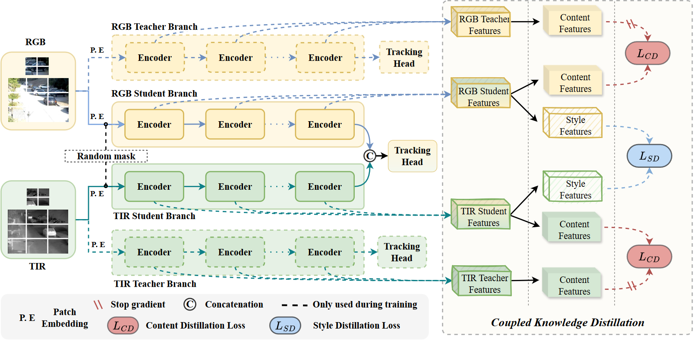

## Coupled Knowledge Distillation (CKD)
Coupled Knowledge Distillation CKD is a simple and effective training framework that pursues common styles of different modalities to break modality gap for high performance RGBT tracking. Importantly, CKD does not introduce additional computational cost in the inference process.

# Train

In fact, our training process is divided into two steps; 
if you don't need the Multi-modal Candidate token Elimination (MCE) module, ignore the second step.

1. We adopt [OSTrack-RGBT](https://github.com/botaoye/OSTrack) as our base tracker. For our best result, we need to load the parameter from [DropMAE](https://github.com/jimmy-dq/DropTrack). Then train with CKD like the above image.

2. `MCE` module could accelerate the inference process, but need to further fintune the tracking head to maintain the proformance. Note that, this stage not adopt CKD and need frozen the backbone.

# Inference

In the inference process, we only need two student branch and their tracking head. So it is just fast as our baseline.

# Results and Models

Model    | Checkpoint and Raw result   | PR/SR     | MACs(G)| FPS |
---------|--------------|-----------|--------|-----|
CKD w/o CE      | [download](https://pan.baidu.com/s/1WkD8Vm310_0Ey9UABaXSNQ?pwd=nq1k) | 72.3/57.4 | 57.802 | 84.8
CKD w/ CE DropMAE | [download](https://pan.baidu.com/s/1WkD8Vm310_0Ey9UABaXSNQ?pwd=nq1k) | 73.0/58.0 | 42.735 | 96.4
CKD w/ MCE DropMAE  | [download](https://pan.baidu.com/s/1WkD8Vm310_0Ey9UABaXSNQ?pwd=nq1k) | 73.2/58.1 | 42.735 | 96.4
